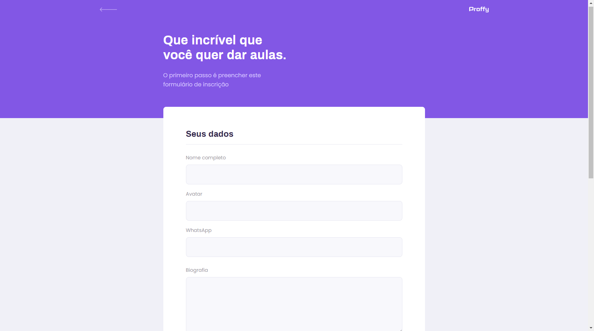
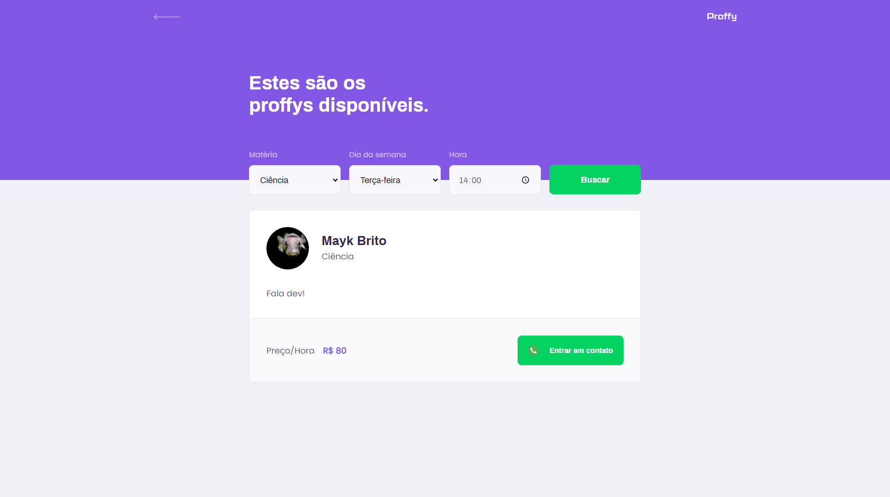

<h1 align="center">
    
</h1>


> [@Rocketseat](https://rocketseat.com.br/)

<h3 align="center">
    Project developed during Next Level Week #2 
       
</h3>


## 🎭 Layout   

**Figma**

- [x] [Web](https://www.figma.com/file/FtQPgbjm0DTST9NFTnt3vS/Proffy-Web-2.0-(Copy))
- [x] [Mobile](https://www.figma.com/file/deAede5PHvL1sNIqAU9IGO/Proffy-Mobile-2.0-(Copy))

### Web Screenshot 💻

**Home** 🏡


---

**Give classes** 📝



---

**Filter** 🗃 



---

### Mobile Screenshot 📱


---


## 👨‍💻 Technologies

- [Typescript](https://www.typescriptlang.org/)
- [React](https://pt-br.reactjs.org/)
- [Expo](https://expo.io/)

## 🧰 Features

> Application to connect teachers and students.

## 🏃‍♂️💨 Running project

``` bash
git clone https://github.com/LeonardoCampello-dev/Proffy.git
```

### 👨‍🍳 API

``` bash
# Go to server folder
cd Proffy/server

# Install Dependencies
yarn install

# Run Aplication
yarn start
```

### 💻 Web

``` bash
# Go to web folder
cd Proffy/web

# Install Dependencies
yarn install

# Run Aplication
yarn start
``` 
> Go to http://localhost:3000/ to see the result.

### 📲 Mobile

To run the mobile version you will need the [Expo](https://play.google.com/store/apps/details?id=host.exp.exponent&hl=pt_BR) application installed on your smartphone or an android / ios emulator.

``` bash
# Go to mobile folder
cd Proffy/mobile

# Install Dependencies
yarn install

# Run Aplication
yarn start
```

## 📜 License 

Released in 2020. This project is under the [MIT license](./LICENSE).

## Made with love by [Leonardo Campello](https://www.linkedin.com/in/leonardo-campello-6151a71a5/) 💜


